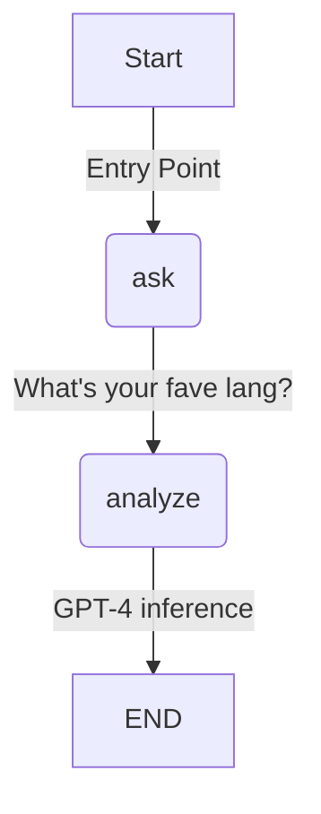
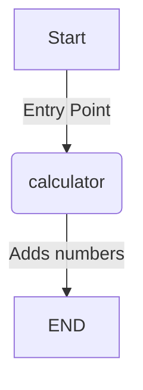
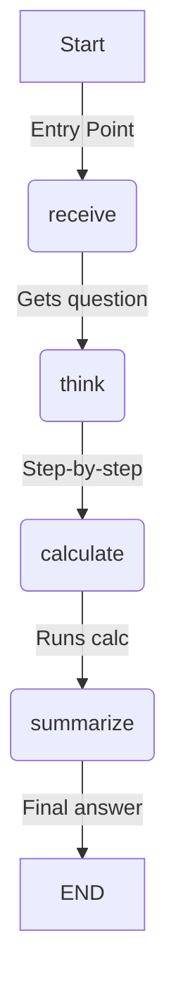
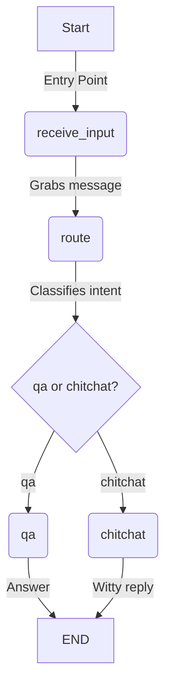

Mermaid chart syntax.  Here's the Mermaid code for your LangGraph flow, ready to plug into a renderer:

### Quick Breakdown (Analogy Time!):
- Think of this like a **game level pipeline**: `ask` is where the player (you) spawns with a question, `analyze` is the boss fight where GPT-4 flexes its brain, and `END` is the victory screen. 🎮
- The `state` is your inventory, carrying `input` and `answer` between nodes.

Paste this into a Mermaid-compatible tool (like mermaid.live) and watch it shine. ✨ Let me know what's next!

---

Hey, calc wizard! 🧮 This one's a lean, mean adding machine, and I've got the Mermaid graph for you. Here's the `.mmd` syntax:

### Quick Vibe Check (Analogy Alert!):
- Picture this as a **vending machine**: You drop in your query ("2 plus 7"), the `calculator` node crunches it like a coin slot, and spits out "9" at `END`. No fluff, just results. 🍬
- The `AgentState` is your receipt, tracking `input` and `output` as it flows.

Stick this in a `calcgraph.mmd` file, pop it into a Mermaid renderer, and you're set! Need more juice for your next coding spree? Hit me up! 🚀

---

Alright, math maestro! 🎉 This one's a multi-step brain teaser, and I've got the Mermaid graph locked and loaded—crisp and zippy, like a turbo-charged IDE. Here's the `.mmd` code:

### Fast Analogy (ADHD-Friendly!):
- Think of this like a **cooking recipe**: `receive` grabs the ingredients (the question), `think` chops it up with logic, `calculate` cooks the numbers, and `summarize` plates the final dish. 🍳 Boom, done!
- The `state` is your kitchen counter, holding `question`, `thought`, `calculation_result`, and `summary`.

Drop this into a `mathgraph.mmd` file, fire it up in a Mermaid tool, and you'll see the flow shine! ✨ What's your next coding adventure? 🚀

---

Hey, chat champ! 🗣️ This one's a slick convo router, and I've got the Mermaid graph ready to roll—short, sharp, and snappy, like a debugger on speed. Here's the `.mmd` code:

### Quick Analogy (ADHD-Approved!):
- Imagine this as a **phone switchboard**: `receive_input` picks up the call, `route` figures out if it's business or banter, then patches it to `qa` for facts or `chitchat` for fun. 📞 Ring, ring—done!
- The `State` is your call log, tracking `history`, `intent`, and `response`.

Pop this into a `chatgraph.mmd` file, load it in a Mermaid renderer, and watch the flow light up! 🌟 What's next on your coding radar? 🚀

 
